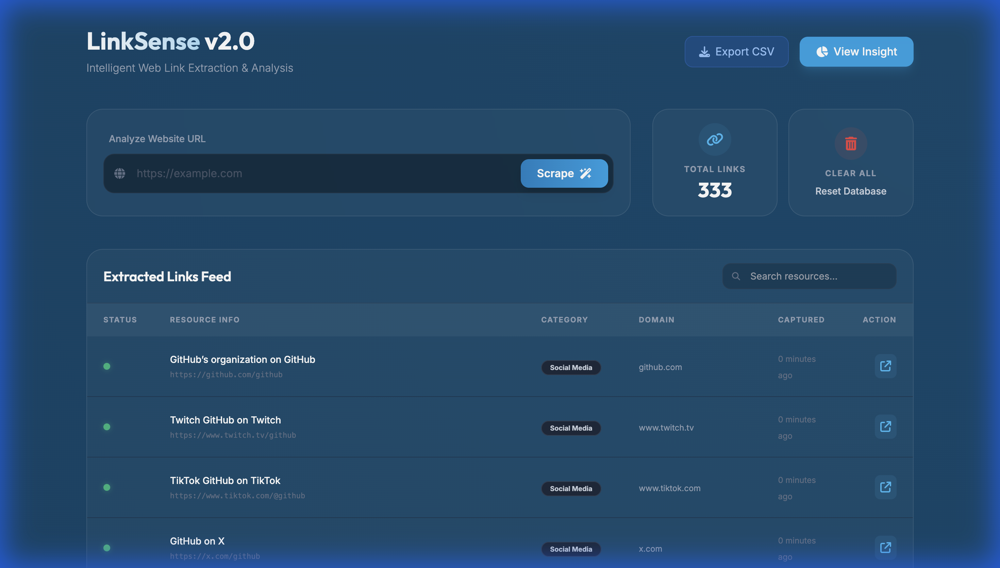

# 🌐 LinkSense v2.0 - Link Intelligence

**LinkSense** is a modernized, Django-powered web application designed for intelligent web link extraction and semantic analysis. It goes beyond simple scraping by categorizing links, analyzing domains, and providing visual insights into web content structures.

---

## ✨ Features (v2.0)

- 🔍 **Intelligent Scraper** – Extract all hyperlinks with full absolute path resolution.
- 🏷️ **Auto-Categorization** – Automatically classifies links into Social Media, Blogs, E-commerce, Documentation, and more.
- 📊 **Insight Dashboard** – Visual distribution of link categories using Chart.js.
- 🌫️ **Modern UI** – Premium Glassmorphism design with Tailwind CSS and Dark Mode.
- 🔎 **Real-time Search** – Filter through hundreds of links instantly.
- 📥 **Data Export** – Download your collected links in CSV format for offline analysis.
- 🗑️ **Data Management** – Single-click database purging with confirmation.

---

## 📸 Screenshots

<p align="center">
  
</p>
<p align="center"><em>The modern, dark-themed dashboard showing extracted links with categories.</em></p>

<p align="center">
  
</p>
<p align="center"><em>Deep content intelligence showing the distribution of link types.</em></p>

---

## ⚙️ Installation & Setup

Follow these steps to set up the project on your local machine:

```bash
# 1. Clone the repository
git clone https://github.com/Shani871/Link-Collector.git
cd Link-Collector

# 2. Set up virtual environment
python3 -m venv venv
source venv/bin/activate  # On Windows: venv\Scripts\activate

# 3. Install dependencies
pip install -r requirements.txt

# 4. Apply migrations
python3 manage.py makemigrations
python3 manage.py migrate

# 5. Run the development server
python3 manage.py runserver
```

🌐 Visit `http://127.0.0.1:8000` in your browser.

---

## 🛠️ Tech Stack

| Layer | Technologies |
| :--- | :--- |
| **Backend** | Django 6.0 (Python) |
| **Scraping** | BeautifulSoup4, Requests |
| **Frontend** | Tailwind CSS (Glassmorphism), Chart.js, Font Awesome 6 |
| **Database** | SQLite3 |

---

## 👤 Author

**Shani Chauhan**  
📧 [chauhanshani145@gmail.com](mailto:chauhanshani145@gmail.com)  

---

Licensed under the MIT License.
